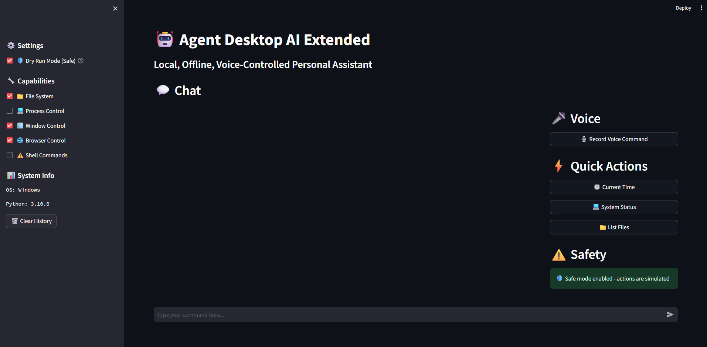
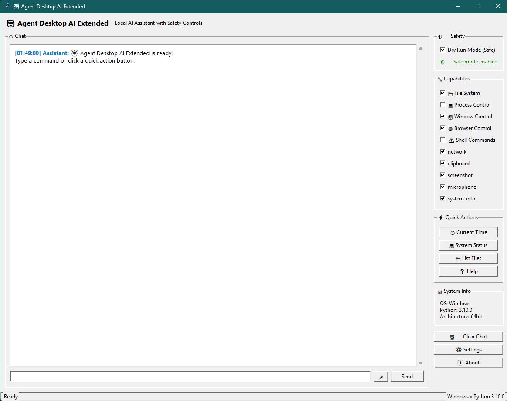

# Agent Desktop AI Extended

A local, offline, multilingual voice-controlled personal assistant with expanded computer context and strict safety boundaries.


## Project Status

This codebase is a work in progress and not complete. It requires changes and further testing before use in production.

## 🚨 SAFETY WARNING

**This software can control your computer, access files, and execute system commands. Always start in DRY RUN mode and carefully review all safety settings before enabling live execution.**

## ✨ Features

### Interface Options
- 🖥️ **Native Windows Desktop App** - Modern tkinter GUI, no browser required
- 🌐 **Streamlit Web Interface** - Browser-based responsive interface
- 💻 **Command Line Interface** - Terminal-based for advanced users
- 🚀 **Smart Launcher** - Choose interface with system status checks

### Core Capabilities
- 🎤 **Offline Voice Recognition** - Using Vosk with multilingual support
- 🧠 **Local AI Processing** - Powered by Ollama (no cloud APIs)
- 🛡️ **Safety-First Design** - Requires explicit consent for sensitive operations
- 📦 **Windows Executable** - Build standalone .exe with PyInstaller

### Computer Control (With Safety Boundaries)
- 📁 **Safe File System Access** - Limited to configured safe paths
- 🪟 **Window Management** - Focus, click, type, screenshot
- 💻 **Process Monitoring** - View system resources and running processes
- 🌐 **Browser Control** - Open URLs and search the web
- 🚀 **App Launching** - Cross-platform application control

### Safety & Security
- 🔒 **Capability System** - Granular control over enabled features
- ✅ **Consent Management** - User confirmation for dangerous operations
- 🏠 **Path Restrictions** - File operations limited to safe directories
- 📊 **Action Logging** - Complete audit trail of all operations
- 🔄 **Dry Run Mode** - Test commands safely before execution

## 🚀 Quick Start

### 1. Prerequisites

**Python 3.8+** is required. Install dependencies:

```bash
pip install -r requirements.txt
```

### 2. Install Ollama (Required for AI)

Download and install Ollama from [https://ollama.ai](https://ollama.ai)

```bash
# Install a model (choose one)
ollama pull gemma3:12b         # Recommended - newest Google model
ollama pull llama2:7b          # Alternative Llama model
ollama pull mistral:7b         # Alternative Mistral model
ollama pull codellama:7b       # Good for code-related tasks

# Start Ollama server
ollama serve
```

### 3. Setup Voice Recognition (Optional)

Download a Vosk model for offline speech recognition:

```bash
# Create model directory
mkdir -p ~/.agent_desktop_ai/vosk-model

# Download and extract a model (English example)
wget https://alphacephei.com/vosk/models/vosk-model-small-en-us-0.15.zip
unzip vosk-model-small-en-us-0.15.zip
mv vosk-model-small-en-us-0.15/* ~/.agent_desktop_ai/vosk-model/
```

**Available Models:**
- `vosk-model-small-en-us-0.15` (40MB) - Fast, good for testing
- `vosk-model-en-us-0.22` (1.8GB) - High accuracy English
- `vosk-model-small-0.15` (40MB) - Multilingual support

### 4. Run the Application

**🚀 Launcher (Recommended for new users):**
```bash
python launcher.py
```
*Choose between Windows Desktop App, Web Interface, or CLI*

**🖥️ Windows Desktop App:**
```bash
python windows_app.py
```
*Native Windows application with modern UI*

**🌐 Web Interface:**
```bash
python start.py
```
*Browser-based Streamlit interface*

**💻 CLI Mode:**
```bash
python start.py --simulate "what time is it"
```
*Command-line interface for advanced users*

## 🛡️ Safety Configuration

### Initial Setup (IMPORTANT)

The application starts in **maximum safety mode** by default:

1. **Dry Run Mode**: All actions are simulated only
2. **Limited Capabilities**: Only safe operations enabled
3. **Consent Required**: Dangerous operations need explicit permission

### Enabling Capabilities

Edit `config/capabilities.json` or use the GUI sidebar:

```json
{
  "fs": false,              // File system access - MEDIUM RISK
  "process_control": false, // Process management - HIGH RISK  
  "window_control": true,   // GUI automation - LOW RISK
  "browser_control": true,  // Web browsing - LOW RISK
  "run_shell": false,      // Shell commands - CRITICAL RISK
  "screenshot": true,       // Screen capture - LOW RISK
  "microphone": true        // Voice input - MEDIUM RISK
}
```

### Safe Paths Configuration

File operations are restricted to safe directories. Configure in `config/user_config.json`:

```json
{
  "safe_paths": [
    "~/Documents",
    "~/Downloads", 
    "~/Desktop",
    "~/Projects"
  ]
}
```

## 📋 Command Examples

### Basic Commands (Always Safe)
```
"What time is it?"
"Show system status" 
"Help"
"Search for python tutorials"
"Open https://github.com"
```

### Window Control (Requires: window_control)
```
"Take screenshot"
"Focus Chrome"
"Type hello world"
"Click at 500, 300"
```

### File Operations (Requires: fs capability)
```
"List files"
"Read config.txt"
"Find python files"
"List files in Documents"
```

### Application Control
```
"Open Chrome"
"Open VS Code"
"Open Calculator"
"Close Notepad" (requires process_control)
```

### Multilingual Support
```
Spanish: "¿Qué hora es?" "Abrir Chrome"
French: "Quelle heure est-il?" "Ouvrir Chrome"  
German: "Wie spät ist es?" "Chrome öffnen"
```

## 🔧 Configuration

### Main Configuration (`config/user_config.json`)

```json
{
  "user_preferences": {
    "default_editor": "vscode",
    "default_browser": "chrome", 
    "voice_language": "en",
    "dry_run_mode": true
  },
  "llm_settings": {
    "model": "llama2:7b",
    "timeout": 30
  },
  "safety": {
    "max_file_size_mb": 5,
    "consent_expiry_days": 30
  }
}
```

### Application Mappings

Customize app launching in the generated `~/.agent_desktop_ai/app_mappings.json`:

```json
{
  "Windows": {
    "myapp": {
      "paths": ["C:\\Path\\To\\MyApp.exe"],
      "start_command": "myapp"
    }
  }
}
```

## 🚨 Security Model

### Three-Layer Safety System

1. **Capabilities**: Features must be explicitly enabled
2. **Path Restrictions**: File access limited to safe directories  
3. **User Consent**: Dangerous operations require confirmation

### Consent System

```
Allow Once    - Execute this time only
Allow Always  - Remember decision for 30 days
Deny         - Block the operation
Cancel       - Abort with timeout
```

### Protected Operations

Operations requiring confirmation:
- File access outside safe paths
- Process termination
- Shell command execution  
- Large file operations (>5MB)

### System Process Protection

These processes cannot be terminated:
- system, kernel, init, systemd
- csrss.exe, wininit.exe, winlogon.exe
- lsass.exe, services.exe, svchost.exe

## 📁 Project Structure

```
agent-desktop-ai-extended/
├── launcher.py               # Smart launcher (choose interface)
├── windows_app.py            # Native Windows desktop application
├── build_windows_app.py      # Windows executable build script
├── main.py                   # Entry point with Streamlit GUI
├── start.py                  # Enhanced startup script
├── requirements.txt          # Python dependencies
├── README.md                # This file
├── WINDOWS_APP_GUIDE.md     # Windows application guide
├── QUICKSTART.md            # Quick start guide
├── INSTALL.md               # Installation instructions
│
├── mic_input/
│   └── listen.py            # Voice recording & Vosk integration
│
├── core/
│   ├── llm_client.py        # Ollama API client
│   ├── intent_parser.py     # Text -> JSON intent conversion
│   ├── task_router.py       # Intent -> Action execution
│   └── safety.py            # Safety & consent management
│
├── commands/
│   ├── open_apps.py         # Cross-platform app launching
│   ├── fs_manager.py        # Safe file system operations
│   ├── process_manager.py   # Process monitoring/control
│   └── window_control.py    # GUI automation
│
├── config/
│   ├── user_config.json     # User preferences
│   ├── capabilities.json    # Feature enable/disable
│   └── tasks.json           # Sample commands
│
├── utils/
│   └── logger.py            # History logging with rotation
│
├── tests/
│   ├── test_intent_parser.py# Intent parsing tests
│   └── test_safety.py       # Safety system tests
│
└── samples/
    └── recorded.wav         # Sample audio file
```

## 🔨 Development

### Running Tests

```bash
# Run all tests
pytest tests/

# Run specific test file
pytest tests/test_intent_parser.py -v

# Run with coverage
pip install pytest-cov
pytest tests/ --cov=. --cov-report=html
```

### Adding Custom Commands

1. **Add Intent Pattern** in `core/intent_parser.py`
2. **Implement Handler** in appropriate command module
3. **Register Handler** in `core/task_router.py`
4. **Add to Help** in task router's help handler

### Extending App Support

Add applications to `~/.agent_desktop_ai/app_mappings.json`:

```json
{
  "Windows": {
    "slack": {
      "paths": ["%LOCALAPPDATA%\\slack\\slack.exe"],
      "start_command": "start slack"
    }
  }
}
```

## 🐛 Troubleshooting

### Voice Recognition Issues

1. **Check microphone permissions**
2. **Verify Vosk model download**
   ```bash
   ls ~/.agent_desktop_ai/vosk-model/
   ```
3. **Test microphone in GUI settings**
4. **Use text input as fallback**

### Ollama Connection Issues

1. **Verify Ollama is running**
   ```bash
   curl http://localhost:11434/api/tags
   ```
2. **Check model installation**
   ```bash
   ollama list
   ```
3. **Restart Ollama service**
   ```bash
   ollama serve
   ```

### Commands Not Executing

1. **Check dry-run mode** - Disable for actual execution
2. **Verify capabilities** - Enable required features in GUI
3. **Review safe paths** - Ensure file access is in allowed directories
4. **Check application paths** - Update app mappings if needed

### Permission Dialogs

- **GUI Mode**: Pop-up confirmation dialogs
- **CLI Mode**: Terminal prompts with timeout
- **Headless**: Automatically denies dangerous operations

## 📚 Advanced Usage

### CLI Flags

```bash
# Safe simulation mode (default)
python main.py --dry-run

# Enable live execution (dangerous!)  
python main.py --run

# Test specific command
python main.py --simulate "open chrome"

# Enable specific capabilities
python main.py --enable-module fs,process_control
```

### Environment Variables

```bash
export AGENT_CONFIG_DIR="./custom-config"
export AGENT_DRY_RUN="true"
export VOSK_MODEL_PATH="./models/vosk"
```

### Logging

Logs are stored in `~/.agent_desktop_ai/logs/`:
- `history.json` - All user interactions
- `errors.json` - Error events
- `agent.log` - Detailed application logs
- `safety_history.json` - Security decisions

## ⚠️ Important Security Notes

1. **Start in DRY RUN mode** - Never skip safety testing
2. **Review safe paths** - Limit file access appropriately  
3. **Enable capabilities gradually** - Don't enable everything at once
4. **Monitor consent decisions** - Review security history regularly
5. **Keep backups** - File operations create automatic backups
6. **Use strong consent** - Don't blindly click "Allow Always"

## 🤝 Contributing

1. **Fork the repository**
2. **Create feature branch** (`git checkout -b feature/amazing-feature`)
3. **Write tests** for new functionality
4. **Ensure safety compliance** - All new features must follow safety model
5. **Submit pull request** with detailed description

## 📄 License

This project is licensed under the MIT License - see the [LICENSE](LICENSE) file for details.

Contributions welcome! See [CONTRIBUTING.md](CONTRIBUTING.md) and our [Code of Conduct](CODE_OF_CONDUCT.md).

## 🙏 Acknowledgments

- **Vosk** - Offline speech recognition
- **Ollama** - Local LLM inference  
- **Streamlit** - Web application framework
- **psutil** - System and process utilities
- **pyautogui** - GUI automation

## ⚡ Quick Reference

## 🧭 Roadmap / Future Plans

- Voice UX
  - Live waveform visual and real-time partial transcription
  - Push-to-talk hotkey; noise suppression and auto gain control
- Chat and Memory
  - Persistent conversation memory with recall controls
  - Rich responses (images, links, code blocks) and tool output summaries
- Models & Inference
  - Pluggable LLM backends (OpenAI, local GGUF, WebGPU) with auto-detection
  - Background model warmup and adaptive timeouts
- Safety & Policy
  - Policy editor UI for capabilities and path rules
  - Fine-grained consent scopes and per-intent cooldowns
- Automation
  - Recorder to convert user actions into automations/macros
  - Scheduler and triggers (time, window focus, network state)
- Packaging & Deployment
  - Cross-platform builds (Windows/macOS/Linux)
  - One-click installer with update channel
- Testing & CI
  - E2E voice tests with recorded samples
  - Coverage gate in CI and nightly dependency updates

Contributions toward any of these areas are welcome—please open an issue to discuss design before submitting a PR.

## 📷 Screenshots

Place your images in `assets/` and update the filenames below.





**Start Application:**
```bash
python main.py
```

**Voice Command:**
- Click "Record Voice Command" button
- Speak clearly after recording starts
- Wait for transcription and execution

**Text Command:**
- Type command in chat input
- Press Enter or click send
- View result in chat history

**Safety Checklist:**
- ✅ Start in dry-run mode
- ✅ Configure safe paths
- ✅ Enable only needed capabilities  
- ✅ Test with simulation first
- ✅ Review consent decisions

---

**Remember: With great power comes great responsibility. Use this tool wisely and always prioritize safety!** 🛡️
